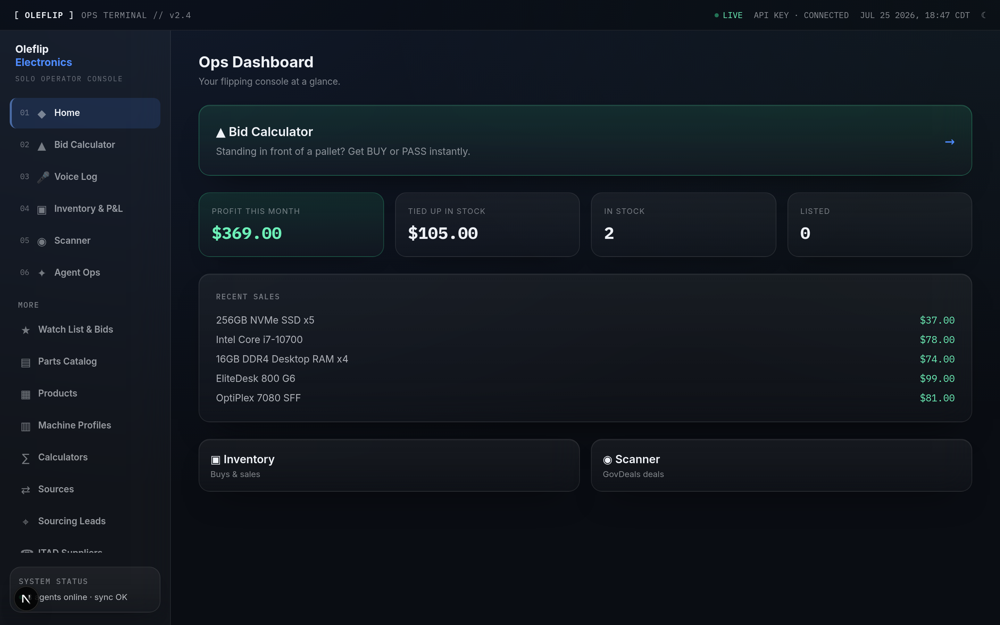
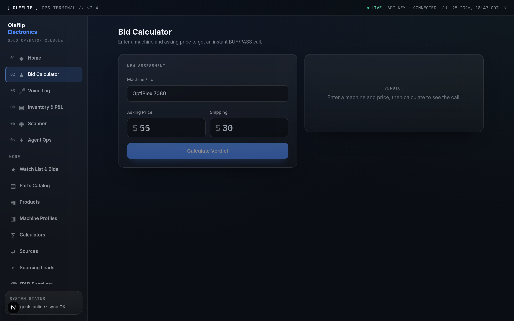
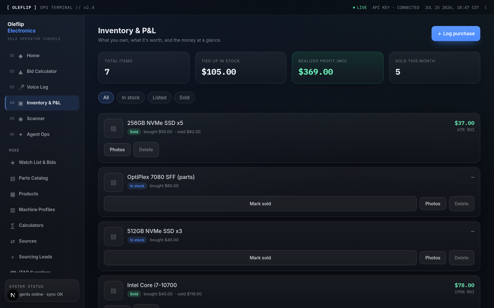
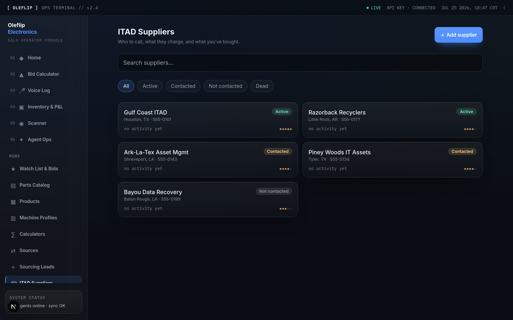
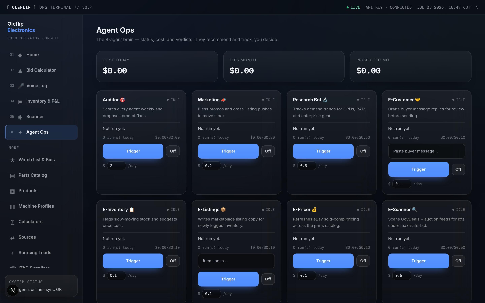
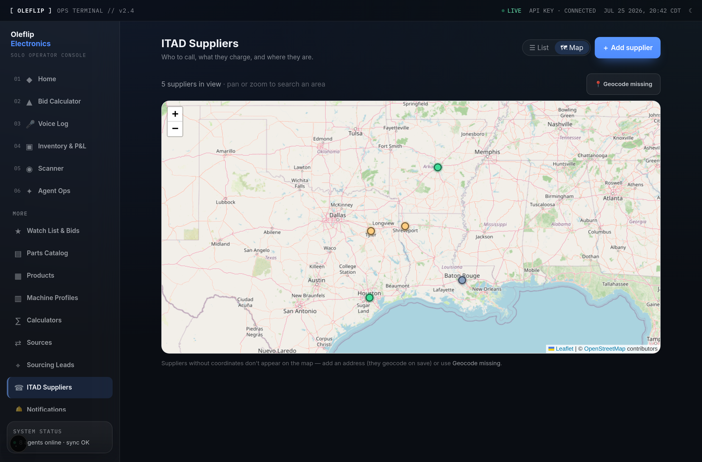
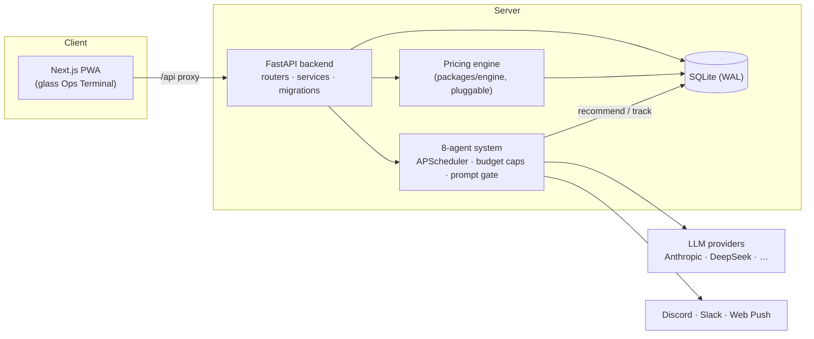

# Oleflip — Electronics Ops Terminal

An AI-driven **operations terminal for an IT-parts reselling business**: bid on
auction lots, track inventory and P&L, source from ITAD suppliers, and run an
autonomous **8-agent back office** — all behind a glassmorphic, installable PWA.

Full-stack monorepo: **FastAPI + SQLite** backend, **Next.js (App Router) +
Tailwind** frontend, a pluggable pricing **engine**, and a multi-agent LLM system
with a cron scheduler, per-agent budget caps, and a human-in-the-loop prompt gate.

> This is a portfolio/reference build. It ships a **self-contained open engine**
> with synthetic data so the whole thing runs locally with **no API keys**.



<table>
  <tr>
    <td width="50%"></td>
    <td width="50%"></td>
  </tr>
  <tr>
    <td width="50%"></td>
    <td width="50%"></td>
  </tr>
</table>



---

## Highlights

- **Bid calculator** — resolves a machine profile, values its parts from recent
  sold comps, and returns a max-safe-bid verdict (BUY/PASS), plus what-if, scrap,
  and lot-compare tools.
- **Inventory + P&L** — cost/price/profit tracking, realized-profit chart, aging
  stock flags, per-item photo galleries (camera capture on mobile).
- **ITAD supplier CRM + map** — companies, call logs, purchases, reliability
  scoring, a derived per-supplier summary, and an interactive **map with
  bounding-box (viewport) search** — geocodes addresses (OpenStreetMap Nominatim)
  so you can source suppliers by region/corridor.
- **8-agent AI system** — scanner, pricer, listings, inventory, customer, research,
  marketing, and a weekly auditor that scores the others and *proposes* prompt
  improvements that a human must approve before they go live.
- **Auto-notify** — deal/stale/brief/failure alerts to **Discord and/or Slack**
  (each optional; either/or/neither) plus Web Push, with dedup + throttling.
- **Voice logging** — speak inventory in; an LLM turns the transcript into
  structured items.
- **PWA** — installable, offline read-cache, mobile-first bottom nav.

## Architecture



The backend depends only on a small set of **public function names** in
`packages/engine/` (`db/`, `models/`, `calculator/`, `scanner/`). Point
`PHASE1_PATH` at your own engine to swap in real pricing/scanner logic without
touching the app.

## Tech stack

| Layer | Tech |
|---|---|
| Frontend | Next.js (App Router), React, TypeScript, Tailwind, TanStack Query |
| Backend | FastAPI, Pydantic v2, SQLite (WAL), APScheduler |
| AI | Multi-provider LLM client (Anthropic / DeepSeek / OpenAI / Grok) |
| Engine | Pluggable Python package (parts catalog, sold-comp pricing, bid math) |
| Infra | Docker Compose, GitHub Actions CI (lint · typecheck · build · secret scan) |

## Quickstart (demo mode — no API keys)

```bash
# 1) Backend (Python 3.11+)
cd packages/backend
python -m venv .venv && . .venv/bin/activate
pip install -e ".[dev]"
uvicorn app.main:app --reload --port 8000     # bundled engine + synthetic seed data

# 2) Frontend (Node 18+), in another shell
cd packages/web
npm install
npm run dev                                    # http://localhost:3000
```

The backend auto-creates and seeds its SQLite DB on first boot (12 sample parts,
3 machine profiles, sold-comp history). The AI agents stay inert until you add
provider keys in `packages/backend/.env` (see `.env.example`); everything else —
bid calculator, inventory, P&L, ITAD CRM, notifications config — works offline.

## Tests

```bash
cd packages/backend && . .venv/bin/activate && pytest -q
```

## License

[Apache-2.0](./LICENSE).
